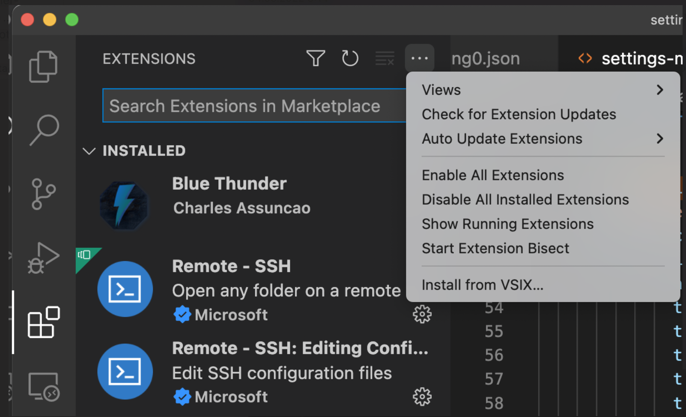
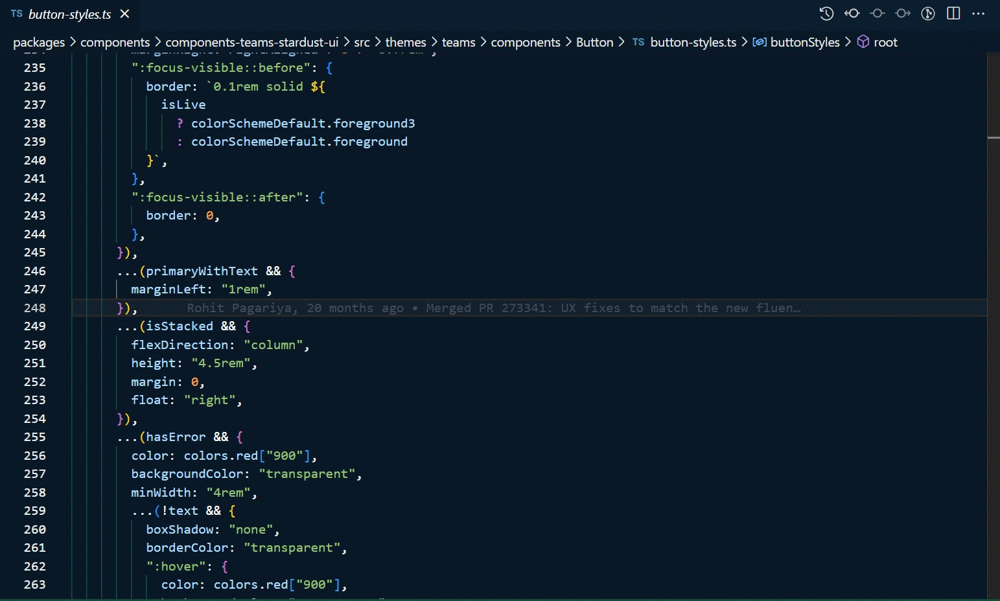
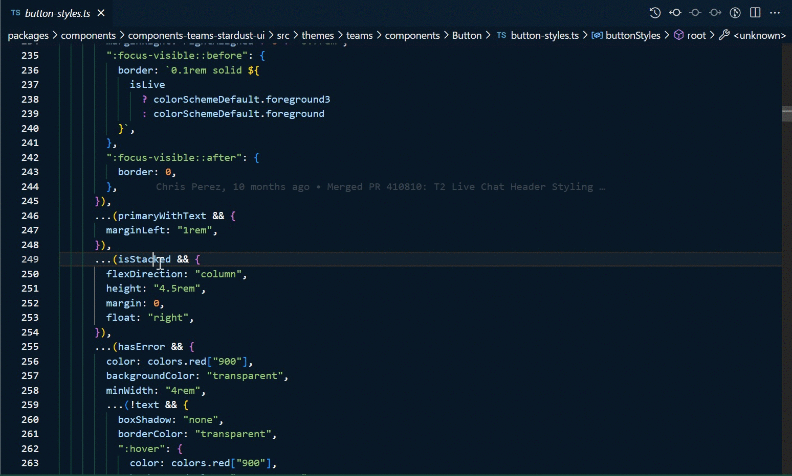

# Transformer

## Installation

1. Download https://github.com/chpalac/vscode-transformer/blob/master/transformer-0.0.1.vsix

2. In Extensions, click on ... and select "Install from VSIX", then select the downloaded file

3. Enjoy

## Usage 

### Ctrl/Cmd+Shift+P > Make Styles:

### Selection:

### Files:

